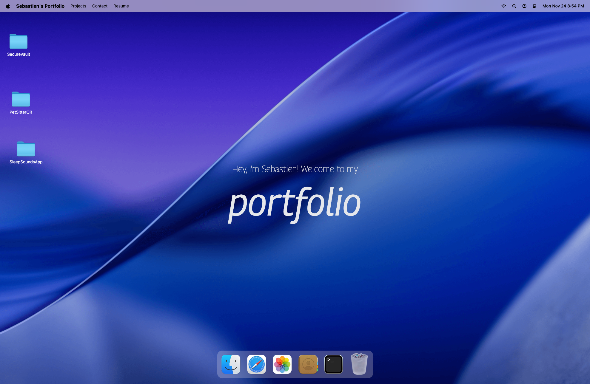

# macOS Portfolio

Interactive portfolio website that recreates the feel of the macOS desktop. Visitors can boot the "machine", open apps from the dock, drag and resize windows, type commands in a working terminal, and explore projects, skills, blog posts, and contact info – all within a playful, desktop-style UI.



## Features

- **Boot screen** – Every load starts with a macOS-style boot animation (Apple logo + progress bar). "Restart…" from the Apple menu reboots it.
- **macOS-inspired shell** – Menu bar with a working Apple menu (About This Mac, System Settings, Restart), a live clock, and an animated dock with running-app indicators.
- **Real window management** – Windows open, focus, minimize to the dock, maximize to fullscreen, drag by their title bar, and resize from the bottom-right corner. All state lives in Zustand.
- **Wallpaper switcher** – System Settings offers macOS-style wallpapers (Sequoia, Sonoma, Ventura, …) plus custom image upload, persisted in `localStorage`.
- **Interactive terminal** – A working zsh-style terminal with command history. Try `help`, `ls`, `open safari`, `stack`, `neofetch`, or `sudo`.
- **Finder-based project explorer** – Custom folders and files defined in `src/constants/index.ts` showcase work, link to repos, display images, and embed copy. The dock's Trash opens in Finder too.
- **Blog + contact windows** – The Safari window renders external articles; the Contact window surfaces email and social links.

## Tech Stack

- [React 19](https://react.dev) + [TypeScript](https://www.typescriptlang.org) + [Vite](https://vitejs.dev) for the SPA foundation
- [Tailwind CSS v4](https://tailwindcss.com) for utility-first styling
- [GSAP](https://gsap.com) + `@gsap/react` for animations, dragging, and the dock magnification
- [Zustand](https://github.com/pmndrs/zustand) (+ Immer and persist middleware) for window, location, and system state
- [Lucide React](https://lucide.dev) for crisp vector icons

## Getting Started

Prerequisites: Node.js 18+ and npm.

```bash
# install dependencies
npm install

# start a local dev server (http://localhost:5173)
npm run dev

# type-check without building
npm run typecheck

# run ESLint
npm run lint

# create a production build (type-checks first)
npm run build

# preview the production build locally
npm run preview
```

## Customizing Content

Most of the portfolio data lives in `src/constants/index.ts`:

- `navLinks`, `dockApps` – control the menu and dock labels/icons.
- `wallpapers` – the wallpaper presets offered in System Settings.
- `locations` – powers the Finder-like explorer, including folders, files, descriptions, and external links.
- `blogPosts`, `techStack`, `socials`, `gallery`, `aboutSpecs` – drive the Safari, Terminal, Contact, Photos, and About This Mac windows.

Shared types (window keys, Finder items, wallpapers, …) are in `src/types.ts`.

Update the image files under `public/images` and `public/files` (or add new assets) to match your own projects. The screenshot above lives at `public/screeshots/screenshot.png`.

## Project Structure

```
src/
  components/     # Navbar, Dock, Welcome hero, BootScreen, shared window controls
  windows/        # Finder, Safari, Terminal, Contact, Resume, Photos, Settings, About, etc.
  hoc/            # WindowWrapper HOC: animations, dragging, minimize/maximize, resizing
  store/          # Zustand stores for window, location, and system (wallpaper) state
  constants/      # Portfolio content configuration
  types.ts        # Shared TypeScript types
public/
  files, icons, images, screeshots, macbook.png
```

Feel free to fork, remix, and deploy – just update the constants, assets, and copy to make the desktop experience your own.
