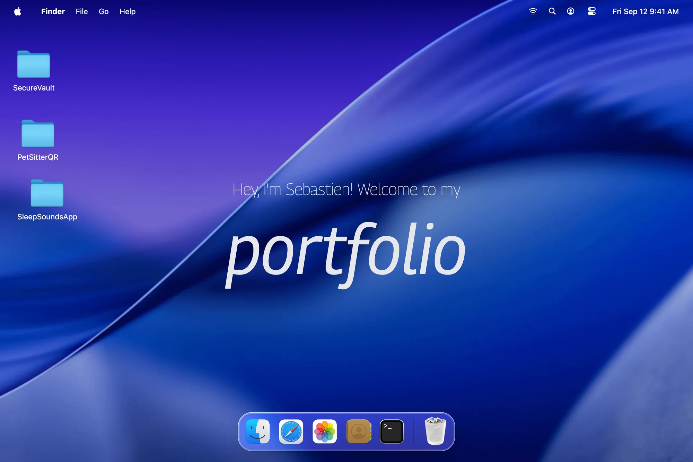
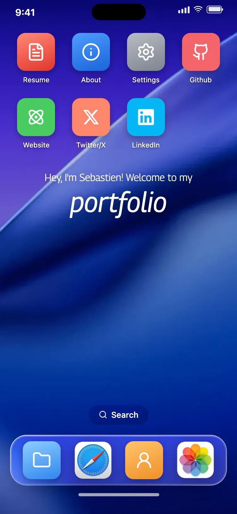

# macOS Portfolio

Interactive portfolio website that recreates the feel of a Mac. Visitors boot the "machine", open apps from the dock, drag, resize and tile windows, type commands in a working terminal, and explore projects, writing, and contact info – all within a playful, desktop-style UI.

On a phone it becomes an iOS-style Home Screen instead: same content, same preferences, an interface that suits the device.

<p align="center">
  
  
</p>

## Features

### The desktop

- **Boot screen** – Every load starts with a macOS-style boot animation (Apple logo + progress bar). "Restart…" from the Apple menu reboots it.
- **Menu bar** – A working Apple menu, per-app menus that swap when you focus a different window (File, Edit, View, Go, Window, Help), a live clock, and a menu bar that tints its own glyphs dark when the wallpaper behind it is bright.
- **Window management** – Windows open, focus, minimize, zoom, drag by their title bar and resize from the corner. Position and size persist. Drag a window to a screen edge to tile it left, right or full, or use the menu behind the green button.
- **Mission Control** – F3, ⌃↑ or the Window menu scales every open window into a grid to pick from.
- **Spotlight** – ⌘K or ⌘Space opens a searchable launcher for every app and Finder location.
- **Control Center & Notification Center** – Wi-Fi, appearance, brightness and volume from the menu bar; notifications and widgets behind the clock.
- **Finder** – Icon, list and column views over a configurable folder tree, with a sidebar, path bar and working Trash.
- **Desktop** – Icons with click, ⌘/⇧ multi-select, rubber-band selection and drag, plus right-click menus on the desktop and the dock.
- **Appearance** – Light, Dark or Auto (follows the OS and re-resolves when it flips), alongside macOS-style wallpapers and custom image upload. Persisted in `localStorage`.
- **Interactive terminal** – A zsh-style terminal with command history. Try `help`, `ls`, `open safari`, `stack`, `neofetch`, or `sudo`.

### The phone

Below 768px – or on a touch device too short for a desktop, i.e. a phone held sideways – the desktop is not merely hidden, it never mounts. A Home Screen renders in its place.

- **Home Screen** – App icons, a dock, a live status bar, and web shortcuts to your links. Tapping an icon zooms the app out of that icon's own box.
- **Eight full-screen apps** – Portfolio (Files), Articles, Gallery, Contact, Resume, Terminal, Settings and About, each reading the same content and preferences as its desktop counterpart.
- **Control Center** – Pulled down from the status bar, sharing Wi-Fi, appearance, brightness and volume with the desktop panel.
- **Back leaves the app, not the site** – Each app sits one history entry deep, so the phone's Back gesture steps out to the Home Screen.
- **Honours `prefers-reduced-motion`** – The open and dismiss animations are skipped rather than shortened.

## Tech Stack

- [React 19](https://react.dev) + [TypeScript](https://www.typescriptlang.org) + [Vite](https://vitejs.dev) for the SPA foundation
- [Tailwind CSS v4](https://tailwindcss.com) for utility-first styling
- [GSAP](https://gsap.com) + `@gsap/react` for animations, dragging, and the dock magnification
- [Zustand](https://github.com/pmndrs/zustand) (+ Immer and persist middleware) for window, location, and system state
- [Lucide React](https://lucide.dev) for crisp vector icons
- [react-pdf](https://github.com/wojtekmaj/react-pdf) for the résumé viewer, split into its own chunk

## Getting Started

Prerequisites: Node.js 18+ and npm.

```bash
# install dependencies
npm install

# start a local dev server (http://localhost:5173)
npm run dev

# type-check without building
npm run typecheck

# run ESLint
npm run lint

# create a production build (type-checks first)
npm run build

# preview the production build locally
npm run preview

# regenerate the README screenshots (needs `npx playwright install chromium` once)
npm run screenshots
```

To see the phone shell, narrow the window under 768px or use your browser's device toolbar.

## Customizing Content

Most of the portfolio data lives in `src/constants/index.ts`, and both shells read from it:

- `navLinks`, `dockApps` – the menu and dock labels/icons.
- `wallpapers` – the wallpaper presets offered in System Settings.
- `locations` – powers the Finder-like explorer, including folders, files, descriptions, and external links.
- `blogPosts`, `techStack`, `socials`, `gallery`, `aboutSpecs` – drive the Safari, Terminal, Contact, Photos, and About This Mac windows.

Two files configure a shell rather than its content:

- `src/mobile/constants.ts` – which apps appear on the Home Screen, which four sit in the dock, and the web shortcuts (derived from `socials`).
- `src/utils/terminal.ts` – the terminal's commands, help text, and the phone's tappable command chips. Shared by both terminals, so they cannot drift apart.

Shared types (window keys, Finder items, wallpapers, …) are in `src/types.ts`.

Update the image files under `public/images` and `public/files` (or add new assets) to match your own projects.

The two screenshots at the top live in `docs/` (kept out of `public/` so they are not deployed) and are generated rather than taken by hand:

```bash
npm run screenshots
```

That boots the app on its own port, waits for the boot screen and the fonts, and writes both `docs/screenshot.webp` and `docs/screenshot-mobile.webp` from the same run — so the pair can never show two different versions of the app. The clock is pinned to 9:41 before the shutter, so regenerating only produces a diff when something real has changed. Viewports and output sizes are at the top of `scripts/screenshots.mjs`.

## Project Structure

```
src/
  components/     # Navbar, Dock, Spotlight, Mission Control, Control Center, …
  windows/        # Finder, Safari, Terminal, Contact, Resume, Photos, Settings, About
  hoc/            # WindowWrapper HOC: animations, dragging, tiling, resizing
  mobile/         # The phone shell: Home Screen, app frame, and its eight apps
  store/          # Zustand stores for window, layout, location, snap and system state
  constants/      # Portfolio content configuration
  utils/          # Terminal engine, menu actions, wallpaper luminance sampling
  index.css       # Desktop styles, Liquid Glass utilities, design tokens
  mobile.css      # Phone styles (imported by index.css)
  types.ts        # Shared TypeScript types
scripts/
  screenshots.mjs # Regenerates the two README screenshots
public/
  files, icons, images, macbook.png
docs/
  screenshot.webp, screenshot-mobile.webp
```

Feel free to fork, remix, and deploy – just update the constants, assets, and copy to make it your own.
