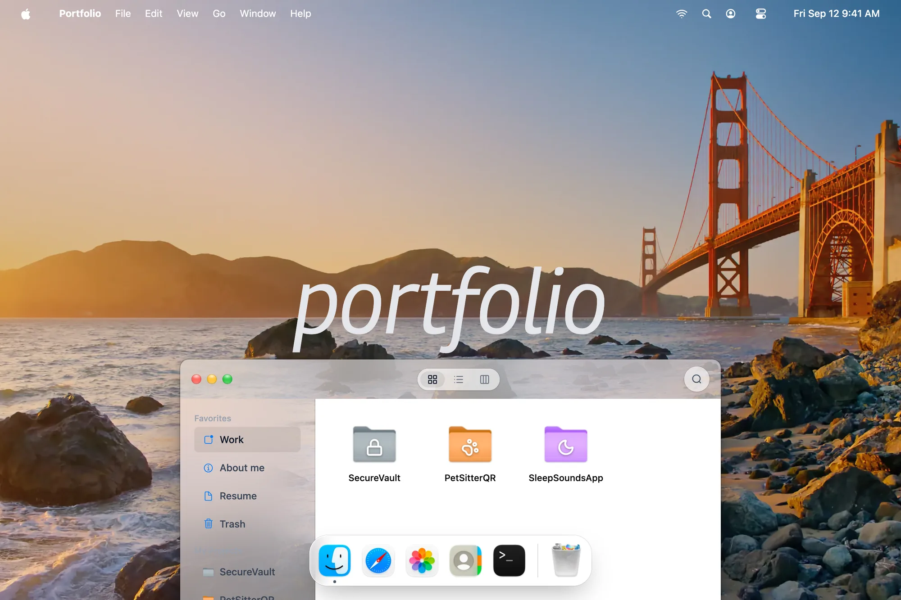
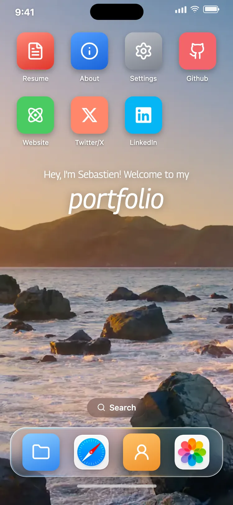

# macOS Portfolio

Interactive portfolio website that recreates the feel of a Mac running macOS 27 Golden Gate. Visitors boot the "machine", open apps from the dock, drag, resize and tile windows, type commands in a working terminal, and explore projects, writing, and contact info – all within a playful, desktop-style UI.

On a phone it becomes an iOS-style Home Screen instead: same content, same preferences, an interface that suits the device.

<p align="center">
  
  
</p>

## Features

### The desktop

- **Boot screen** – Every load starts with a macOS-style boot animation (Apple logo + progress bar). "Restart…" from the Apple menu reboots it.
- **Menu bar** – A working Apple menu, per-app menus that swap when you focus a different window (File, Edit, View, Go, Window, Help), a live clock, and a menu bar that tints its own glyphs dark when the wallpaper behind it is bright. An open menu, Control Center or Notification Center holds its title highlighted in a capsule, as 27 draws it.
- **Golden Gate's window chrome** – The squarer, uniform window corners macOS 27 went back to; traffic lights redrawn as Liquid Glass gel buttons that spring back when pressed; toolbar and sidebar as one continuous surface, with toolbar buttons grouped into glass capsules; sidebar glyphs in the accent colour and the selection a neutral pill. Windows behind the front one lose the wallpaper's colour through their chrome and sit on a flatter shadow, so which window is active is legible at a glance.
- **Window management** – Windows open, focus, minimize, zoom, drag by their title bar and resize from the corner. Position and size persist. Drag a window to a screen edge to tile it left, right or full, or use the menu behind the green button.
- **Mission Control** – F3, ⌃↑ or the Window menu scales every open window into a grid to pick from.
- **Spotlight** – ⌘K or ⌘Space opens it: macOS 27's floating field with four round mode buttons beside it, and results only once there is something to show. Searches apps, projects, files, posts and links, and — as it has since macOS 26 — it can be browsed rather than only searched: the buttons, or ⌘1–⌘4, switch between Apps, Files, Actions and Clipboard History.
- **Spotlight Actions** – The half of Spotlight that does something rather than opening something. Email, copy the address, download the CV, copy a link to the current view, flip the appearance, change the wallpaper, Mission Control, empty the Trash. Each has a two-letter Quick Key (`em`, `ce`, `dr`, …) that outranks a title starting the same way, and the keys are printed in the row rather than left to be guessed at.
- **Quick Look** – Space previews whatever is selected without opening it: an image shows the image, a text file its write-up, a folder what is inside it. Escape or Space again puts it away.
- **Control Center** – macOS 27's layout, measured against the real one: no panel, every control its own module of clear glass on a 64pt grid — Wi-Fi, Bluetooth and AirDrop capsules, Now Playing, round modules, Focus, and Display and Sound on hairline sliders. Apple's Stage Manager, Screen Mirroring and keyboard-brightness cells hold Mission Control, Wallpaper and Spotlight instead. Focus and Sound drill into their own panes, and a Focus is not decorative — turning one on silences Notification Center.
- **Menus** – The Apple menu, app menus and right-click menus in macOS 27's menu material, solved from a real dark-mode menu sampled over two backgrounds: the blurred backdrop mixed a third of the way to neutral grey, a one-pixel dark edge, 13px corners, 24px rows.
- **Notification Center** – Notifications and widgets behind the clock, drawn from the real content so they cannot drift from what the site says. Laid out as macOS 27 draws it, measured against the real one: no panel, a titled column of separate glass cards, then widgets on the widget grid.
- **Finder** – Icon, list and column views over a configurable folder tree, with a sidebar, path bar and working Trash. One click selects and two open, as the Finder does, which is what makes spacebar preview reachable from a pointer.
- **Folder colours and badges** – macOS 26's folder customisation. Right-click a folder → Get Info to give it any of nine tints and a badge; the swatches are the folder artwork under the same hue rotation the icons use, so what you pick is what gets drawn. Overrides only, so Reset returns a folder to whatever the content authored.
- **Desktop** – Right-click menus on the desktop, the dock and Finder items. A right-click opens with nothing highlighted, as on a Mac; Shift+F10 opens the same menu from the keyboard with the first item ready.
- **Cursor** – The arrow everywhere, never the pointing hand: a Mac shows the arrow over buttons, menu items, the dock and links alike. The I-beam in text fields and the resize arrows at window edges stay, because macOS shows those too.
- **Appearance** – Light, Dark or Auto (follows the OS and re-resolves when it flips), alongside macOS wallpapers — Golden Gate back to Big Sur — and custom image upload. Persisted in `localStorage`. The default is the Golden Gate Sunset photograph. Golden Gate's abstract wallpaper — Apple's own default — sits beside it, and like the real one it is dynamic: a light picture and a dark one, following the appearance. Sonoma, Ventura, Monterey and Big Sur are Apple's own defaults too, each dynamic in the same way. Sequoia is its photograph; Tahoe and Midnight are gradients. Every image wallpaper ships a phone-sized copy, and a dynamic one a pair of each.
- **Liquid Glass** – macOS 27's material: frosted by default, with the darkened edge and brighter, more even specular rim 27 introduced. System Settings → Appearance has its slider, with Apple's three notches — Ultraclear, Default (where it starts) and Fully Tinted — calibrated against captures of the shipping release: blur carries the change, on a curve, so Tinted washes the wallpaper to its own colour rather than to white. Reduce Transparency still wins at any setting, and the slider says so rather than moving to no effect.
- **Accent colour** – Eight colours, running through selections, menu highlights, sidebar glyphs and the focus ring in both shells. One CSS variable on `<main>`; nothing is hardcoded blue any more.
- **Icons** – macOS 27's own, rendered from the system rather than collected (each app bundle's icon via `NSWorkspace`, and AppKit's two Trash images, drawn in the Light appearance and saved as 256px WebP), so every app icon sits on the same grid. The Trash is drawn full or empty depending on what is in it.
- **Icon styles** – Default, Dark, Clear and Tinted, the appearances macOS has offered since 26. Worked out of flat artwork rather than layered icons: Dark and Clear are filters, and Tinted is a masked overlay in `mix-blend-mode: color`, which takes hue from the accent and leaves each icon's own light and shade underneath — so a tinted icon keeps its modelling instead of flattening to a silhouette.
- **Interactive terminal** – A zsh-style terminal with command history. Try `help`, `ls`, `open safari`, `stack`, `neofetch`, or `sudo`.

### The phone

Below 768px – or on a touch device too short for a desktop, i.e. a phone held sideways – the desktop is not merely hidden, it never mounts. A Home Screen renders in its place.

- **Home Screen** – App icons, a dock, a status bar with a Dynamic Island and cellular bars, and web shortcuts to your links. Tapping an icon dims it and zooms the app out of that icon's own box, as iOS does — icons darken under a finger rather than shrinking away from it. Icon geometry follows the real thing: 60pt tiles on a 27pt pitch, labels at 11px, and corners at 22% of the tile, which is where the artwork's own corner begins when you measure it.
- **Large titles** – Each app opens with a 34px title in the page, not the bar, and the navigation bar is genuinely absent above it — no material, no hairline, the content running to the top of the screen. Scroll and the title goes under the bar, which fades its glass in, draws its hairline and picks the title up at 17px. What watches for that is an `IntersectionObserver` on the heading itself, so nothing has a scroll threshold written down to drift out of step with the type.
- **Search** – The pill iOS puts above the dock, opening a sheet over the blurred wallpaper. It indexes what the desktop's Spotlight walks — apps, projects, the files inside them, articles, links — since someone on a phone is looking for the same things.
- **Seven full-screen apps** – Portfolio (Files), Articles, Gallery, Contact, Resume, Settings and About, each reading the same content and preferences as its desktop counterpart, and each laid out as iOS grouped-inset cards: a heading, a card, and a line of footer text under the thing it explains. There is no terminal: iOS has never shipped one, and `#/terminal` opened on a phone lands on the Home Screen rather than somewhere the link never asked for.
- **Control Center** – Pulled down from the status bar, sharing every control with the desktop's: connectivity, Focus, appearance, brightness and volume.
- **Back leaves the app, not the site** – Each app sits one history entry deep, so the phone's Back gesture steps out to the Home Screen.
- **Honours `prefers-reduced-motion`** – The open and dismiss animations are skipped rather than shortened.

### Findable

The desktop keeps its content inside windows, and a window that has not been opened is not in the DOM — so a crawler arriving here found a hero, a dock, and no prose at all. `scripts/seo-plugin.ts` writes the substance into `index.html` at build time: `Person`, `WebSite` and `SoftwareApplication` structured data in the head, and a plain readable page in a `<noscript>` for anything that does not run JavaScript, which is also what a visitor with scripts turned off deserves to get. Both are generated from `src/constants`, so neither can drift from what the app shows.

`robots.txt` is served from `public/`; `sitemap.xml` is emitted by the same plugin.

### Linkable

Every window has an address, so a project can be sent to someone rather than described to them, and a refresh lands back where it was.

```
#/work/securevault                      Finder, inside a project
#/work/securevault/securevault-png      …with that file open on top
#/articles  #/gallery  #/terminal       a window that is only itself
```

Segments are slugs of the names in `src/constants/index.ts`, so renaming a folder changes its URL and nothing has to be kept in step by hand. The same links work on a phone, where they open the matching app — which matters, since a link shared from a desktop is usually opened on one. The URL names only the front window; everything else that was open is restored from the session, keeping addresses short enough to paste.

### Accessibility

- **Reduced motion** – `prefers-reduced-motion` is honoured in both shells. The boot sequence is skipped, windows open and minimise without travelling, the dock stops magnifying, the hero's letters stop thickening, and every CSS transition and keyframe is collapsed. GSAP opts out through `src/utils/motion.ts`; the CSS side is one rule in `src/index.css`.
- **Reduced transparency** – `prefers-reduced-transparency` is honoured too, which for a design built on Liquid Glass is the setting that matters most. Every surface goes opaque and every blur is dropped, including the menu bar, which normally has no material of its own. System Settings → Accessibility can also force it on, with no option to force it back off: an app does not get to override an accessibility preference upward.
- **Keyboard** – The menu bar takes ↑/↓ within a menu and ←/→ along the bar, with Escape handing focus back to the title. The Apple menu and the right-click menus share the same arrow-key handling, and Shift+F10 raises a right-click menu from the keyboard. Every menu bar control is a real button, so Spotlight and Notification Center are reachable without a pointer. In the Finder, Tab moves the selection, Enter opens and Space previews; the icon view also takes the arrow keys, ←/→ walking the flow across row edges and ↑/↓ jumping a row, measured against however many icons the window is currently fitting across. Spotlight is a combobox driving a listbox, so each result is announced as it is highlighted.
- **Focus** – A visible ring on every control, `:focus-visible` so it appears for the keyboard and stays out of a mouse user's way, with a halo that keeps it legible over any wallpaper. Menu items are the exception: the accent fill is their focus indicator, as it is in macOS.

## Tech Stack

- [React 19](https://react.dev) + [TypeScript](https://www.typescriptlang.org) + [Vite](https://vitejs.dev) for the SPA foundation
- [Tailwind CSS v4](https://tailwindcss.com) for utility-first styling
- [GSAP](https://gsap.com) + `@gsap/react` for animations, dragging, and the dock magnification
- [Zustand](https://github.com/pmndrs/zustand) (+ Immer and persist middleware) for window, location, and system state
- [Lucide React](https://lucide.dev) for crisp vector icons
- [react-pdf](https://github.com/wojtekmaj/react-pdf) for the résumé viewer, split into its own chunk

## Getting Started

Prerequisites: Node.js 20.19+ or 22.12+ (Vite 7's minimum) and npm.

```bash
# install dependencies
npm install

# start a local dev server (http://localhost:5173)
npm run dev

# type-check without building
npm run typecheck

# run ESLint
npm run lint

# run the unit tests (Vitest), or `npm run test:watch` while working
npm test

# create a production build (type-checks first)
npm run build

# preview the production build locally
npm run preview

# regenerate the README screenshots (needs `npx playwright install chromium` once)
npm run screenshots
```

To see the phone shell, narrow the window under 768px or use your browser's device toolbar.

## Customizing Content

Most of the portfolio data lives in `src/constants/index.ts`, and both shells read from it:

- `navLinks`, `dockApps` – the menu and dock labels/icons.
- `wallpapers` – the wallpaper presets offered in System Settings. An image wallpaper can carry a `mobileValue` (a smaller copy for the phone) and a `dark` pair, which makes it dynamic; `src/utils/wallpaperSource.ts` picks the right file for the screen and the appearance.
- `locations` – powers the Finder-like explorer, including folders, files, descriptions, and external links. A folder can also carry a `folderColor` and a `folderBadge`, which is the look it ships with before anyone changes it in Get Info.
- `contactEmail` – the address the Contact window prints and Spotlight's copy actions write to the clipboard. One copy, so the two cannot disagree.
- `focusModes`, `soundOutputs` – what Control Center's Focus and Sound panes list.
- `blogPosts`, `techStack`, `socials`, `gallery`, `aboutSpecs` – drive the Safari, Terminal, Contact, Photos, and About This Mac windows.

Two files configure a shell rather than its content:

- `src/mobile/constants.ts` – which apps appear on the Home Screen, which four sit in the dock, and the web shortcuts (derived from `socials`).
- `src/utils/terminal.ts` – the terminal's commands and help text, kept apart from the window that renders them so they can be tested directly.

Shared types (window keys, Finder items, wallpapers, …) are in `src/types.ts`.

Update the image files under `public/images` and `public/files` (or add new assets) to match your own projects.

The two screenshots at the top live in `docs/` (kept out of `public/` so they are not deployed) and are generated rather than taken by hand:

```bash
npm run screenshots
```

That boots the app on its own port, waits for the boot screen and the fonts, opens a Finder window for the desktop shot, and writes both `docs/screenshot.webp` and `docs/screenshot-mobile.webp` from the same run — so the pair can never show two different versions of the app. It then composes those two into `public/og.jpg`, the 1200×630 card that link previews use, which keeps the shared image in step with the site.

Each file is only rewritten when something visibly moved. The clock is pinned to 9:41 before the shutter, and Chromium's rasteriser drifts by a pixel value or two between runs, so without that check every regeneration would dirty the working tree. Viewports, output sizes and the threshold are at the top of `scripts/screenshots.mjs`.

## Project Structure

```
src/
  components/     # Navbar, Dock, Spotlight, Quick Look, Get Info, Control Center, …
  windows/        # Finder, Safari, Terminal, Contact, Resume, Photos, Settings, About
  hoc/            # WindowWrapper HOC: animations, dragging, tiling, resizing
  mobile/         # The phone shell: Home Screen, search, and its seven apps
  store/          # Zustand stores for window, layout, location, snap, system,
                  #   Quick Look, Get Info, folder looks and clipboard history
  constants/      # Portfolio content configuration
  utils/          # Terminal engine, menu actions, clipboard, wallpaper
                  #   sources and luminance
  test/           # Vitest setup; the specs themselves sit beside what they test
  index.css       # Desktop styles, Liquid Glass utilities, design tokens
  mobile.css      # Phone styles (imported by index.css)
  types.ts        # Shared TypeScript types
scripts/
  screenshots.mjs # Regenerates the two README screenshots and og.jpg
  seo-plugin.ts   # Build-time structured data, <noscript> page and sitemap
  strip-ds-store.ts # Keeps Finder's .DS_Store files out of the build
public/
  files, fonts, icons, images, macbook.png, og.jpg, robots.txt
docs/
  screenshot.webp, screenshot-mobile.webp
```

Feel free to fork, remix, and deploy – just update the constants, assets, and copy to make it your own.
